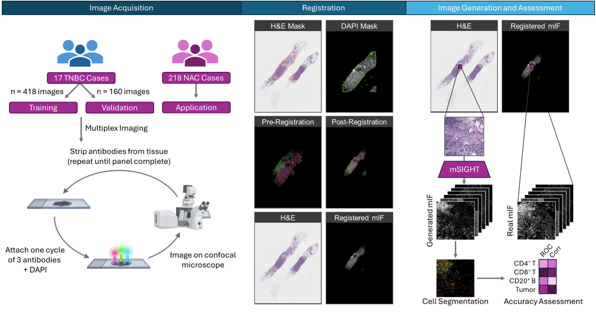

# mSIGHT
<b>M</b>ultiplex <b>S</b>ynthetic <b>I</b>mmunofluorescence <b>G</b>enerated from <b>H</b>&amp;E <b>T</b>ransformed Histology (mSIGHT) is a GAN-based deep learning pipeline that translates from Hematoxylin and Eosin (H&E) stain to Multiplex Immunofluorescence (mIF) images.



This repository contains code that accomplishes the following:

1. Register paired Whole Slide Images (WSIs).
2. Generate and visualize mIF markers (CD20, CD3, CD4, CD8, Cytokeratin and DAPI)
3. Perform cell classification and compute cell density and adjacency metrics.


## Software Requirements

- [Slideflow](https://github.com/jamesdolezal/slideflow)
- [Valis](https://github.com/MathOnco/valis)
- [Cellpose](https://github.com/mouseland/cellpose)


## Steps

### WSI Registration
Registration between pairs of WSIs was done using [Valis](https://github.com/MathOnco/valis), a software developed to register a series of WSIs with rigid and non-rigid transformations. Refer to [Valis documentation](https://valis.readthedocs.io/en/latest/index.html) for installation and usage.

A sample code block for registration can be found in `wsi_registration.py`. 

Valis outputs thumbnail images of the WSIs before and after registration. If you wish to train a model using this pipeline, we recommend visually inspecting the results of registration before proceeding to the next step.

### Slide Tiling
WSIs were divided into 512 x 512 tiles using [Slideflow](https://github.com/jamesdolezal/slideflow). 

A slideflow project needs to be created prior to tile extraction. A sample project is provided in `sample_slideflow_project` to illustrate the structure and components of a project. Sample code for tile extraction can be found in `tile_extraction.py`.

Refer to [slideflow documentation](https://slideflow.dev) for installation and additional usage.

### H&E to mIF Translation
We used a modified Reg-GAN architecture for translation. The original Reg-GAN ([code](https://github.com/Kid-Liet/Reg-GAN) and [paper](https://arxiv.org/pdf/2110.06465)) was designed for MRIs.

See `Reg-GAN/reggan_environment.yml` for dependencies.

Use the Reg-GAN module in this repository for this task. Arguments and parameters are passed to models using yaml files.

To **train** a model, edit the following in `Reg-GAN/Yaml/RegGan.yaml` to provide locations for training inputs and targets. 

```bash
save_root: "/path/to/model/result/"
image_save: "/path/to/model/result/images"
model_save: "/path/to/model/result/model_weights"
tilesdir: "/path/to/training/tiles"
valdir: "/path/to/validation/tiles"
```

Adjust training hyperparameters as needed in the same yaml file. 

Refer to the provided image tiles (see the Data Availability section below) for the file structure of input data. Alternatively, you may modify the dataloaders in `Reg-GAN/trainer/datasets.py` to fit the file structure of your data.

Run the following to train a model:

```bash
cd Reg-GAN
python3 train.py --config Yaml/RegGan.yaml --run train
```

To **Evaluate** a trained model, edit the following in `Reg-GAN/Yaml/RegGan.yaml` to provide paths to saved model weights, input H&E images and locations to save the outputs.

```bash
model_save: "/path/to/model/result/model_weights"
eval_input: "/path/to/HE/tiles/*.png"
eval_save: "/path/to/save/generated/tiles"
```

Run
```bash
cd Reg-GAN
python3 train.py --config Yaml/RegGan.yaml --run evaluate
```

### Cell Level Metrics
To perform cell segmentation, choose a Cellpose model that suits your application (see [Cellpose documentation](https://cellpose.readthedocs.io/en/latest/)) and run `cell_segmentation.py` with paths to input/output directories and path to Cellpose pretrained model. 

Calculate cell level density metrics for both real and generated tiles as illustrated in  `cell_classification.py`. Perform clustering on real cells and manually assign each cluster a label. Fit a classifier on the clustering results and classify cells on generated images.

Calculate cell-to-cell adjacency metrics in `cell_to_cell_dist.py`.

# Data Availability
H&E and mIF image tiles used for training and validation can be found [here](https://zenodo.org/records/13124223).
